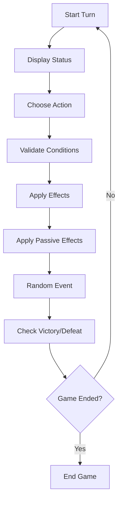

# Drunken Best Man EFSM

DrunkenBestManEFSM is a C# console game that models a turn-based Extended Finite State Machine.

A drunken best man wakes up at a strip club. He must recover enough to remember the correct church, pick up the wedding rings, manage fuel, money, health, hangover, and time, then reach the correct church before losing.

## Project Purpose

This project was built to practice:

- Extended Finite State Machines
- Layered architecture
- Domain-driven separation of rules and effects
- Console application design
- XML-based text resources
- Automated testing
- Balance and path simulation

## EFSM Model

The game uses this EFSM transition model:

```text
delta(CurrentLocation, Action, GameState) [Condition] / Effect -> NewLocation, UpdatedGameState
```

- `CurrentLocation`: where the player is.
- `Action`: what the player attempts.
- `GameState`: extended state with stats, resources, flags, and random setup values.
- `Condition`: rule that validates whether the action is allowed.
- `Effect`: state changes caused by the action.
- `NewLocation`: resulting location.
- `UpdatedGameState`: modified state after the action.

This is an EFSM because transitions depend not only on location and action, but also on `Health`, `Hangover`, `Drunkenness`, `Fuel`, `Money`, `RemainingTime`, `CarLocation`, `HasRings`, and `CorrectChurchKnown`.

## Gameplay Overview

- Start at `StripClub`.
- Drive or walk between locations.
- Manage fuel, money, time, health, hangover, and drunkenness.
- Spend money at `StripClub` for a risky recovery option that restores a random amount of health.
- Buy electrolytes and fuel at `GasStation`.
- Buy alcohol at `Bar` as a risky shortcut.
- Pick up rings at `JewelryStore`.
- Find or remember the correct church.
- Enter the correct church with rings to win.

## Core Mechanics

### Health

Losing all health causes defeat. Vomiting and alcohol can reduce health.

The `StripClub` provides a paid recovery option that restores a random amount of health and consumes time. This gives the starting location a tactical purpose without making recovery free or guaranteed.

### Hangover

Hangover represents dehydration and physical deterioration. It increases passively, electrolytes reduce it, and reaching `100` causes defeat by dehydration. Electrolytes are primarily a hangover recovery tool and should only provide limited health recovery.

### Drunkenness

Drunkenness represents active intoxication. It decreases over time, alcohol increases it, and high drunkenness can block driving and increase risk.

### Fuel

Fuel is required for driving. Driving saves time but consumes fuel. Walking does not consume fuel, but it may leave the car behind.

### Car Location

If the player walks, the car stays behind. If the player drives, the car moves with the player. Driving requires the car to be at the current location.

### Rings

The player must pick up the rings at `JewelryStore`. Reaching the correct church without rings does not win.

### Correct Church

The correct church is random. The player can remember it only when hangover and drunkenness are low enough.

## Victory and Defeat

Victory requires:

- Current location is the correct church.
- Player has rings.
- `RemainingTime > 0`
- `Health > 0`
- `Hangover < 100`

Defeat happens when:

- `RemainingTime <= 0`
- `Health <= 0`
- `Hangover >= 100`

Drunkenness does not directly cause defeat, but it can indirectly cause failure by blocking driving and increasing risk.

## Architecture

The project uses layered architecture:

```text
Presentation -> Application -> Domain
Infrastructure -> Application contracts
```

- `Domain`: EFSM rules, effects, maps, state, results, and transitions.
- `Application`: use cases and orchestration.
- `Infrastructure`: XML text provider and random provider.
- `Presentation`: console UI, menus, renderers, input, and output.

The Domain layer does not depend on console, XML, infrastructure, or presentation concerns.

## Repository Structure

```text
src/DrunkenBestManEFSM/
|-- Domain/
|   |-- Enums/
|   |-- Models/
|   |-- Rules/
|   |-- Effects/
|   |-- Maps/
|   |-- Results/
|   `-- Transitions/
|-- Application/
|   |-- Contracts/
|   |-- DTOs/
|   |-- Results/
|   `-- Services/
|-- Infrastructure/
|   |-- Random/
|   `-- Xml/
|-- Presentation/
|   |-- Console/
|   |-- Menus/
|   `-- Renderers/
|-- Resources/
|   `-- Texts/
`-- Program.cs

tests/
`-- DrunkenBestManEFSM.Tests/

docs/
|-- architecture.md
|-- efsm-model.md
`-- diagrams/
```

## XML Text Resources

Narrative and UI texts are stored in:

```text
src/DrunkenBestManEFSM/Resources/Texts/game-texts.xml
```

This keeps long messages out of game logic and lets the presentation layer resolve message keys through the application text-provider contract.

## Running the Project

Requirements:

- .NET SDK with `net10.0` support
- No database required
- No external runtime services required

Commands:

```bash
dotnet restore
dotnet build
dotnet run --project src/DrunkenBestManEFSM/DrunkenBestManEFSM.csproj
```

## Running Tests

```bash
dotnet test
```

Or run the test project directly:

```bash
dotnet test tests/DrunkenBestManEFSM.Tests/DrunkenBestManEFSM.Tests.csproj
```

The test suite includes Domain rule tests and balance/path simulation tests.

## Diagrams

Existing documentation:

- [EFSM model](docs/efsm-model.md)
- [Architecture](docs/architecture.md)
- [EFSM state flow](docs/diagrams/efsm-state-flow.mmd)
- [Turn flow](docs/diagrams/turn-flow.mmd)
- [Layered architecture](docs/diagrams/layered-architecture.mmd)
- [Game map](docs/diagrams/game-map.mmd)
- [Resource pressure](docs/diagrams/resource-pressure.mmd)
- [State ownership](docs/diagrams/state-ownership.mmd)

High-level turn loop:



## Development Approach

The project was built incrementally using small commits:

- Repository setup
- EFSM documentation
- Architecture documentation
- Domain enums, models, rules, effects, maps, and transitions
- Application use cases
- Infrastructure XML loading
- Presentation console UI
- Tests
- Balance simulations
- README documentation
